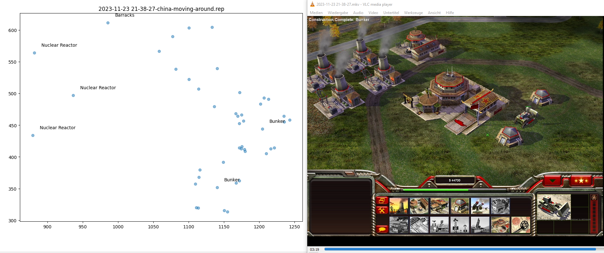
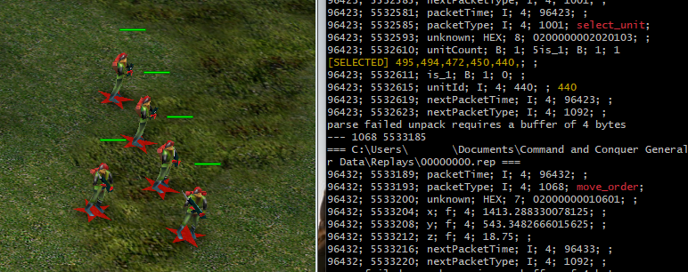

# Command and Conquer Generals Replay Parser

Python scripts to parse Command and Conquer Generals Replays. During live game play or stored files. Tested with the included files and Zero Hour.

* [Technical Information](https://www.dennissalzner.de/gamemods/2023/11/25/Sa-DecodingCommandAndConquerReplays.html)

## Contributing & Compiling from source

The code consists of four Python scripts that can be directly run and adapted to your needs.

Anyone is welcome to contribute, see [Guide on Contributing](CONTRIBUTING.md)

## Release History

### 2023-11-23

* decodes most of the important orders for the "Zero Hour" expansion and China faction.
