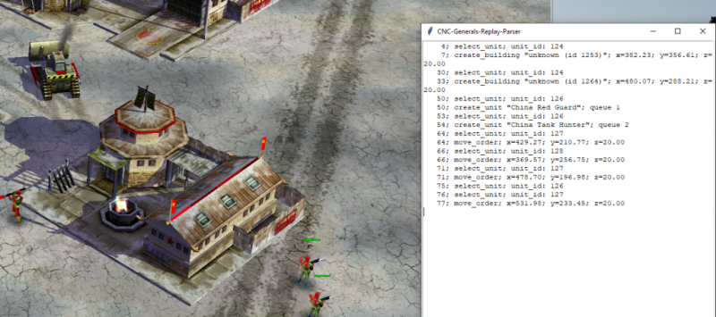

# Command and Conquer Generals Replay Parser

Python scripts to parse Command and Conquer Generals Replays. During live game play or stored files. Tested with the included files and Zero Hour.


* [Technical Information](https://www.dennissalzner.de/gamemods/2023/11/25/Sa-DecodingCommandAndConquerReplays.html)

## Running the code

For coloured console output to work run in "Git Bash" (not ```cmd``` or ```powershell```).

### Offline Mode

* change ```replay_file``` variable, if required

```
cd /src
python main_file.py
```

### Live Game Play

Start a skirmish game. The parser is best tested on

* C&C Generals **Zero Hour**
* with the **China** as the only faction
* on the **Whiteout** map
* with **game speed on 30**
* and **50k starting cash**

Then run the parser.

```
cd /src
python main.py
```

note:
* as the building ids are loaded dynamically by the game you may need to adjust values in the ```buildingTypeMap``` in ```packets.py```
* additionally, depending on game configuration, the header may vary in length so ```formatLiveReplayHeader``` may need adjustment

### Graphical User Interfaces

There are two graphical user interfaces

#### To demonstrate parser callbacks:

```
cd /src/gui/
python simple.py
```

* demonstrates ```create_building```, ```create_unit```, ```move_order```, ```select_unit``` hooks
* displays log in a separate window



#### To investigate effectiveness of build sequences

```
cd /src/gui/
python chart.py
```

* shows unit creation time and estimated arrival time,
* taking the buildings build queue into consideration
* and displays a Gannt-style chart


This allows finding the most effective build sequences.

For example:

* with 16 barracks, in 178 seconds, only 120 tank hunter units can be produced before depleating the starting cash


* but with only 12 barracks, albeit in 222 seconds, we get 140 tank hunter units before depleating the starting cash


## Contributing

The code consists of four Python scripts that can be directly run and adapted to your needs.

Anyone is welcome to contribute, see [Guide on Contributing](CONTRIBUTING.md)

## Release History

### 2024-05-10

* parser callback hook that can be used to detect unit creation
* added two TKinter UIs. One for a log window and one for a Gannt-style chart of build sequences

### 2023-11-23

* decodes most of the important orders for the "Zero Hour" expansion and China faction.
